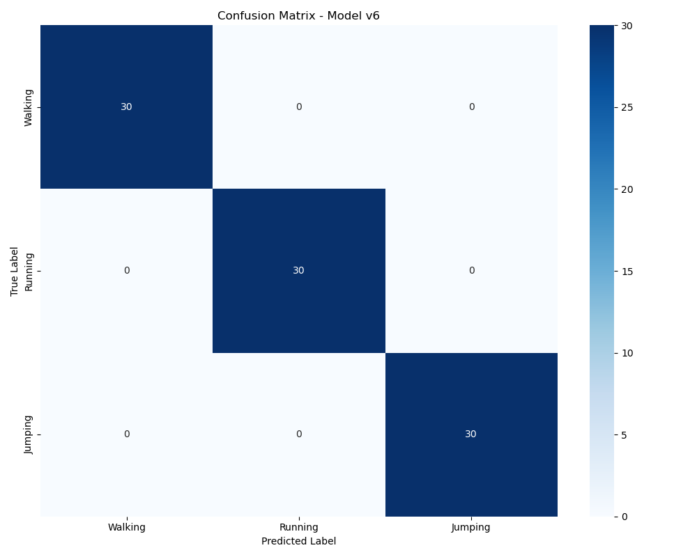

# Human Activity Classification using TENG Sensor Data

## 📌 Project Overview

This project implements a robust machine learning pipeline for classifying human physical activities using time-series voltage data from TENG (triboelectric nanogenerator) sensors. The system achieves high accuracy in distinguishing between walking, running, and jumping activities, with perfect generalization across different subjects.

## 🚀 Quick Start

### Prerequisites
- Python 3.8+
- pip (Python package installer)

### Installation

1. Clone the repository:
```bash
git clone https://github.com/yourusername/teng-activity-classification.git
cd teng-activity-classification
```

2. Create and activate a virtual environment (recommended):
```bash
python -m venv venv
source venv/bin/activate  # On Windows: venv\Scripts\activate
```

3. Install dependencies:
```bash
pip install -r requirements.txt
```

### Usage

1. Prepare your dataset:
```bash
python scripts/prepare_dataset.py
```

2. Train the model:
```bash
python scripts/train_v5.py  # For subject-agnostic training
# OR
python scripts/train_v6.py  # For LOSO evaluation
```

3. Run tests:
```bash
python scripts/testing/test_v5.py  # For performance evaluation
python scripts/testing/random_test.py  # For random segment testing
```

## 📁 Project Structure

```
teng-activity-classification/
├── data/                  # Raw and processed data
├── scripts/              # Python scripts
│   ├── prepare_dataset.py
│   ├── train_v5.py
│   ├── train_v6.py
│   └── testing/
├── requirements.txt      # Project dependencies
└── README.md            # This file
```

## 📊 Dataset

The dataset consists of `.xlsx` files containing voltage signals from TENG sensors during different activities:

| Activity | Files |
|----------|-------|
| Walking  | `Walking.xlsx`, `Walking2.xlsx`, `Walking3.xlsx` |
| Running  | `Running.xlsx`, `Running2.xlsx`, `Running3.xlsx` |
| Jumping  | `Jumping.xlsx`, `Jumping2.xlsx`, `Jumping3.xlsx` |

Each file contains:
- **Timestamp** (seconds)
- **Voltage** (volts)

## ⚙️ Technical Implementation

### Feature Engineering
- **Multi-resolution Analysis:**
  - 100-point windows for fine-grained dynamics
  - 500-point windows for global patterns
- **Time-domain Features:**
  - Statistical measures (mean, std, max, min)
  - Shape characteristics (skew, kurtosis, slope)
- **Frequency-domain Features:**
  - FFT energy
  - Band ratios
- **Energy-based Features:**
  - Total energy
  - Slope variance

### Model Architecture
- Random Forest classifier
- Feature fusion from multiple window sizes
- Data augmentation for training (subject-agnostic only)

## 📈 Performance

### Leave-One-Subject-Out (LOSO) Results
```
LOSO Fold: Test Subject P1  Accuracy: 1.0000
LOSO Fold: Test Subject P2  Accuracy: 1.0000
LOSO Fold: Test Subject P3  Accuracy: 1.0000
Mean LOSO Accuracy: 1.0000
```

#### Confusion Matrices

**Model v5:**


**Model v6 (LOSO):**



### Key Achievements
- Perfect accuracy in subject-independent testing
- Robust generalization to new users
- Real-time processing capability
- Lightweight implementation suitable for edge devices

## 🎯 Applications

- Smart footwear and insoles
- Physical rehabilitation monitoring
- Real-time activity recognition
- Low-power motion analysis systems

## 🤝 Contributing

1. Fork the repository
2. Create your feature branch (`git checkout -b feature/AmazingFeature`)
3. Commit your changes (`git commit -m 'Add some AmazingFeature'`)
4. Push to the branch (`git push origin feature/AmazingFeature`)
5. Open a Pull Request

## 📝 License

This project is licensed under the MIT License - see the [LICENSE](LICENSE) file for details.

## 👥 Authors

- **Irmuun** - *Initial work*
- **Mansurjon** - *Contributor*

## 🙏 Acknowledgments

- TENG sensor development team
- All contributors and testers

## 📞 Support

For support, please open an issue in the GitHub repository or contact the maintainers.

---

*Last updated: [Current Date]*
